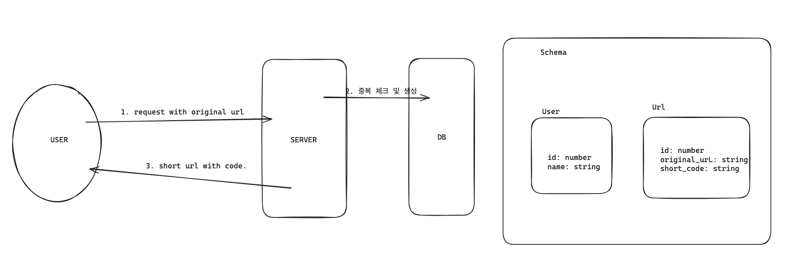
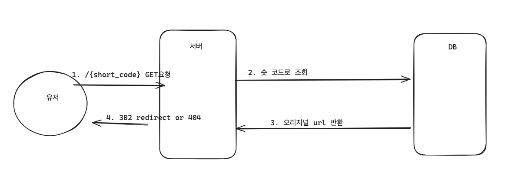
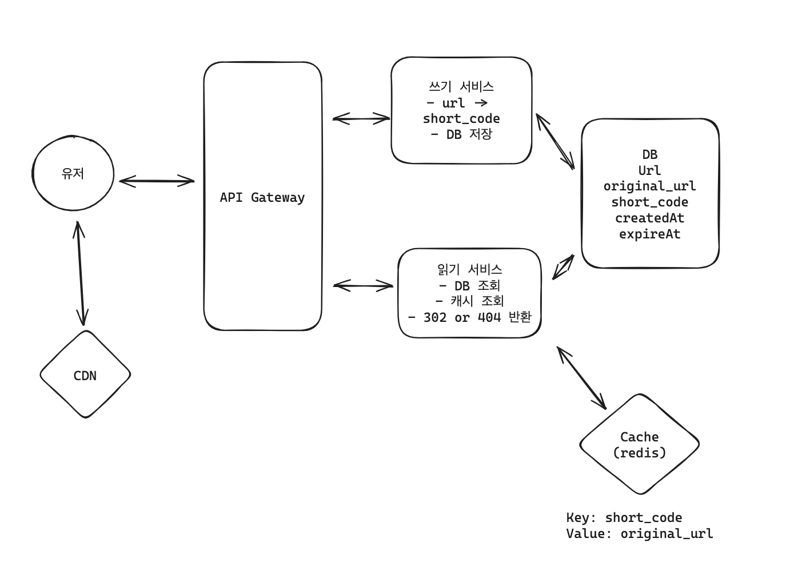

# URL Shortener Service Design

네이버의 단축 URL 서비스와 유사한 고성능, 고가용성 URL 단축 서비스를 설계합니다.

## 1. 요구사항 정의

### 기능적 요구사항
- **URL 단축**: 사용자는 긴 URL을 입력하여 짧게 단축된 URL을 생성할 수 있습니다.
- **커스텀 설정**: 사용자는 선택적으로 단축 URL의 별칭(Alias) 및 만료 시간을 설정할 수 있습니다.
- **리다이렉션**: 단축 URL 접속 시 원래의 URL로 즉시 이동합니다.

### 비기능적 요구사항
- **고유성**: 생성된 모든 단축 URL은 중복되지 않아야 합니다.
- **저지연**: 리다이렉션 지연 시간은 100ms 미만이어야 합니다.
- **고가용성**: 시스템은 중단 없이 운영되어야 하며, 데이터 일관성보다 가용성을 우선합니다.
- **확장성**: 단축 URL 10억 개 및 일일 활성 사용자(DAU) 1억 명 규모를 수용할 수 있어야 합니다.

## 2. 데이터 모델링 및 API 설계

### 핵심 엔티티 (Core Entities)
- **Url**: original_url, short_code, created_at, expired_at, user_id
- **User**: id, email, created_at

### API 명세
| Method | Endpoint | Description |
| :--- | :--- | :--- |
| `POST` | `/urls` | 단축 URL 생성 (Body: `originalUrl`, `name?`, `expiredAt?`) |
| `GET` | `/urls` | 사용자의 URL 목록 조회 (Pagination 권장) |
| `PATCH` | `/urls/{id}` | URL 정보 수정 |
| `GET` | `/{shortCode}` | 원본 URL로 리다이렉트 |

> **💡 설계 고려사항**
> - 리다이렉션 시 **302 (Found)** 상태 코드를 사용하여 트래픽 분석 및 동적 업데이트가 가능하도록 설계합니다.
> - `GET /urls` API의 경우 대량의 데이터 조회를 대비해 페이지네이션을 적용합니다.

## 3. 상세 설계 및 Q&A

### Q1. URL 생성 프로세스는 어떻게 구성되나요?

- **설계 요점**: 클라이언트의 요청을 받아 DB에 저장하고 고유한 Short Code를 반환합니다. 
- **추가 고려**: 만료 및 분석 기능을 위해 `createdAt` 타임스탬프를 필수적으로 관리합니다.

### Q2. 리다이렉션은 어떤 방식으로 동작하나요?

- **설계 요점**: `shortCode`를 키로 DB/Cache를 조회하여 원본 URL을 찾아 응답합니다.
- **301 vs 302**: 본 설계에서는 **302 Found**를 선호합니다. 301은 브라우저 캐싱으로 인해 서버를 거치지 않게 되어 분석 데이터 추적이 어렵지만, 302는 모든 요청이 서버를 거치므로 정확한 통계 수집과 유연한 URL 관리가 가능합니다.

### Q3. 단축 URL의 고유성과 효율적인 생성 방법은?
- **Base62 인코딩**: Auto-increment ID를 기반으로 Base10을 Base62로 변환하여 짧고 중복 없는 고유 코드를 생성합니다.

### Q4. 빠른 리다이렉션을 위한 최적화 전략은?
- **캐싱 계층**: Redis와 같은 In-memory DB를 활용하여 빈번하게 접근되는 URL 정보를 캐싱합니다.
- **인덱싱**: RDBMS 수준에서 `short_code` 필드에 인덱스를 생성하여 검색 성능을 극대화합니다.

### Q5. 초당 1만 건 이상의 리다이렉션을 처리하기 위한 확장 전략은?

- **CDN 도입**: Cloudflare와 같은 CDN을 최전방에 배치하여 엣지 수준에서 리다이렉션을 처리하고 서버 부하를 줄입니다.
- **계층적 아키텍처**: CDN -> Redis -> DB 순의 계층적 조회를 통해 성능을 확보합니다.
- **CQRS**: Read 요청과 Write 요청의 서비스를 분리하고, 로드밸런서를 통해 수평적 확장(Scale-out)이 가능한 구조를 구축합니다.

